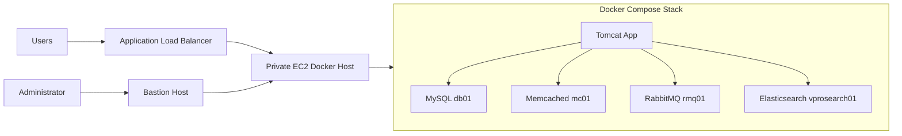

# VProfile Secure Docker Deployment on AWS

A professional, security-focused Docker Compose deployment for the VProfile Java application. The complete stack runs on one private EC2 instance and is accessed through an AWS Application Load Balancer. A hardened bastion host provides controlled administrative access to the private instance.

## Architecture



Detailed network and security-group diagrams are available in [`docs/ARCHITECTURE.md`](docs/ARCHITECTURE.md).

## Stack

| Service | Container hostname | Purpose | Host exposure |
|---|---|---|---|
| Tomcat | `app` | Java web application | EC2 private IP port `8080` |
| MySQL 8.0.33 | `db01` | `accounts` database | None |
| Memcached | `mc01` | Application cache | None |
| RabbitMQ | `rmq01` | Message broker | None |
| Elasticsearch 5.6.4 | `vprosearch01` | Legacy search backend | None |

## Security highlights

- Non-root Tomcat runtime.
- Runtime secrets are not embedded in Docker images.
- Read-only container filesystems where supported.
- Dropped Linux capabilities and `no-new-privileges`.
- Dedicated internal Docker network for every backend service.
- No host port mappings for MySQL, RabbitMQ, Memcached, or Elasticsearch.
- Memcached UDP disabled.
- Dedicated RabbitMQ account and virtual host.
- Dedicated MySQL application user.
- Health checks, resource limits, PID limits, persistent volumes, and log rotation.
- ALB-to-EC2 access restricted by security-group reference.
- Private EC2 administration through a bastion host.

## Repository structure

```text
.
├── .github/workflows/validate.yml
├── config/rabbitmq.conf
├── database/db_backup.sql
├── docker/
│   ├── app/Dockerfile
│   ├── elasticsearch/Dockerfile
│   ├── memcached/Dockerfile
│   ├── mysql/Dockerfile
│   └── rabbitmq/
│       ├── Dockerfile
│       └── secure-entrypoint.sh
├── docs/
│   ├── ARCHITECTURE.md
│   ├── DEPLOYMENT.md
│   ├── SECURITY.md
│   └── TROUBLESHOOTING.md
├── scripts/
│   ├── backup-volumes.sh
│   ├── deploy.sh
│   ├── generate-secrets.sh
│   ├── prepare-host.sh
│   ├── reset-lab.sh
│   └── status.sh
├── secrets/.gitignore
├── .env.example
├── compose.yaml
├── Makefile
└── README.md
```

## Quick start

```bash
git clone https://github.com/YOUR_USERNAME/vprofile-secure-docker-aws.git
cd vprofile-secure-docker-aws
cp .env.example .env
```

Edit `.env` and set `APP_BIND_IP` to the EC2 private IP.

```bash
chmod +x scripts/*.sh docker/rabbitmq/secure-entrypoint.sh
sudo ./scripts/prepare-host.sh
sudo ./scripts/generate-secrets.sh
sudo ./scripts/deploy.sh
```

Check the stack:

```bash
sudo docker compose ps
sudo docker compose logs -f app
```

The full AWS deployment process, including ProxyJump through the bastion and ALB target-group configuration, is documented in [`docs/DEPLOYMENT.md`](docs/DEPLOYMENT.md).

## Build images manually

```bash
sudo docker compose build --pull
```

The application image clones the upstream `Master` branch, builds `vprofile-v2.war`, changes Spring to read `/run/secrets/app_properties`, extracts the WAR in the JDK build stage, and runs the application as UID/GID `10001` in the final Tomcat image.

## Common operations

```bash
make validate
make up
make status
make logs
make backup
make down
```

## Important notes

- The database initialization script runs only when the MySQL volume is empty.
- The private EC2 instance needs NAT or suitable VPC endpoints to pull images and reach GitHub. The bastion only provides administrative access.
- This is a single-host architecture and therefore has a single point of failure.
- Elasticsearch 5.6.4 and several application dependencies are legacy. The service is isolated for compatibility, but dependency modernization is required before production use.

## Documentation

- [Architecture](docs/ARCHITECTURE.md)
- [AWS deployment](docs/DEPLOYMENT.md)
- [Security controls](docs/SECURITY.md)
- [Troubleshooting](docs/TROUBLESHOOTING.md)
- [GitHub upload instructions](GITHUB_UPLOAD.md)

## License and attribution

The deployment files in this repository are available under the MIT License. The VProfile application is retrieved from an external repository during the image build and is covered by its own ownership and licensing terms. See [`NOTICE.md`](NOTICE.md).
