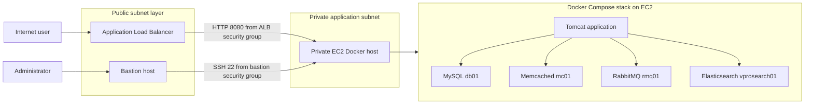
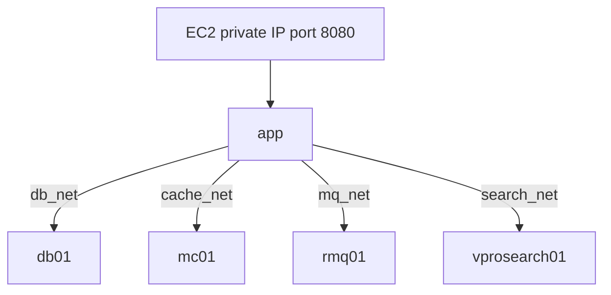

# Architecture

## AWS layout

The ALB is the only application entry point. The Docker host has no public IPv4 address. The bastion is used only for controlled administrative access.

## Container isolation

Only `app:8080` is published on the EC2 host. All backend networks are marked `internal: true`, and backend service ports are not published.

## Security-group matrix

| Security group | Inbound rule | Source |
|---|---:|---|
| ALB SG | 443 | Intended clients or the Internet |
| ALB SG | 80 | Optional HTTP-to-HTTPS redirect |
| Docker EC2 SG | 8080 | ALB SG only |
| Docker EC2 SG | 22 | Bastion SG only |
| Bastion SG | 22 | Administrator public IP `/32` only |

Do not open MySQL `3306`, RabbitMQ `5672`, Memcached `11211`, Elasticsearch `9200/9300`, or RabbitMQ management `15672` on the EC2 security group.
